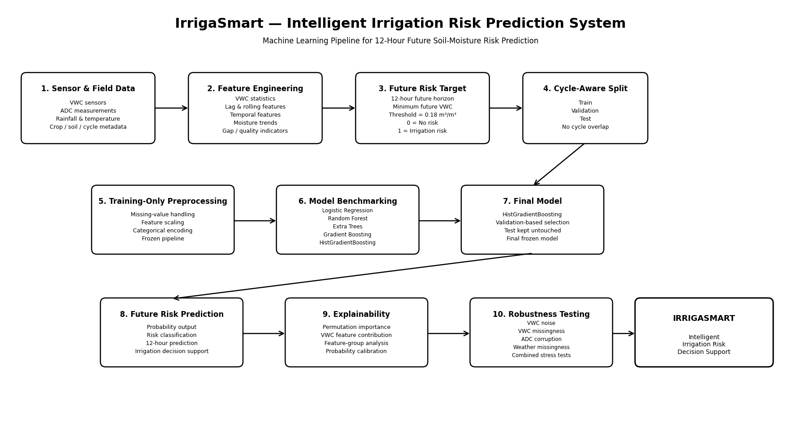
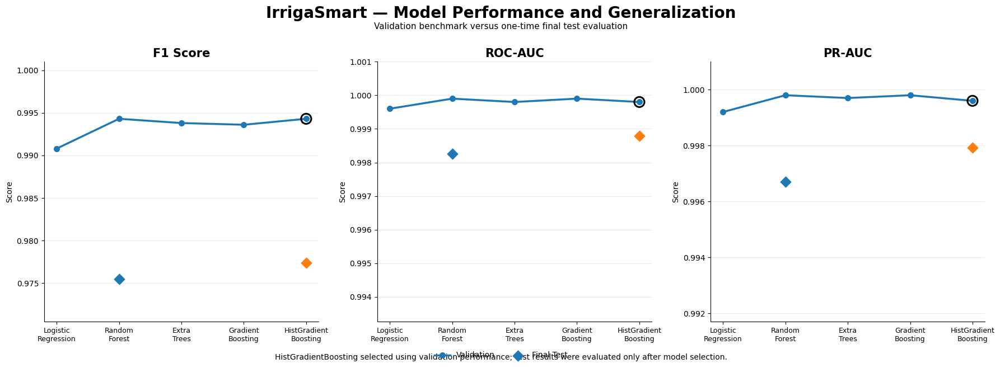
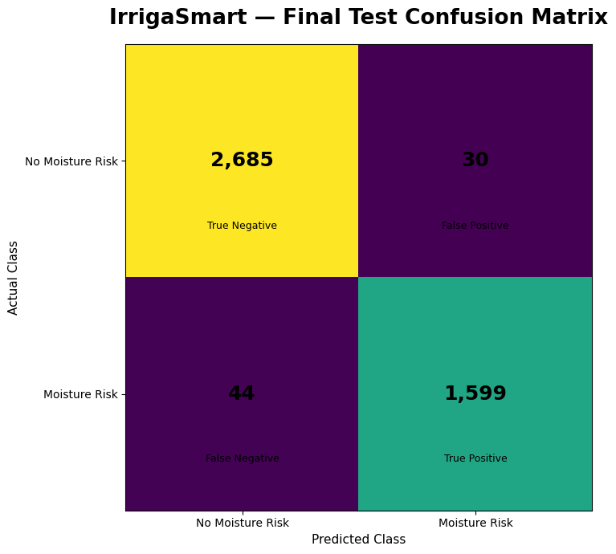
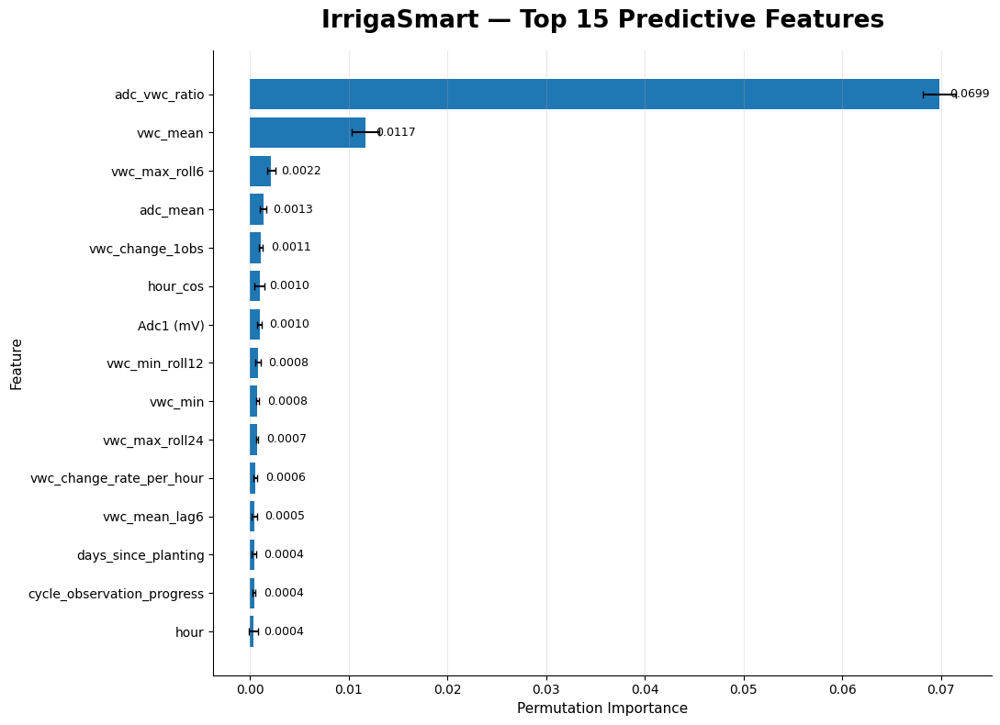
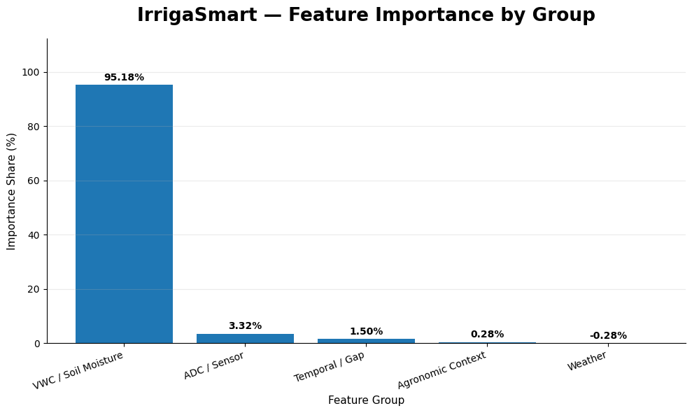
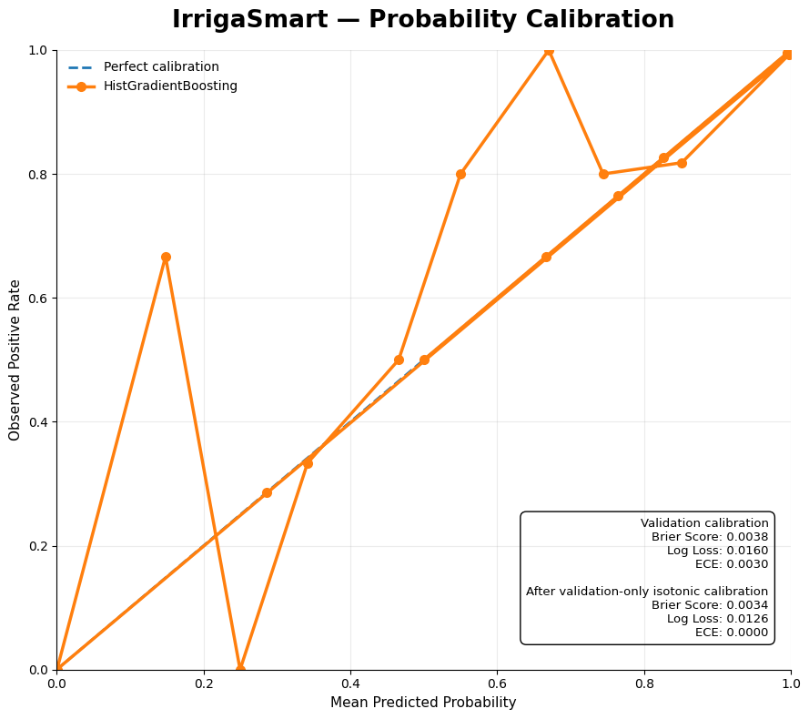
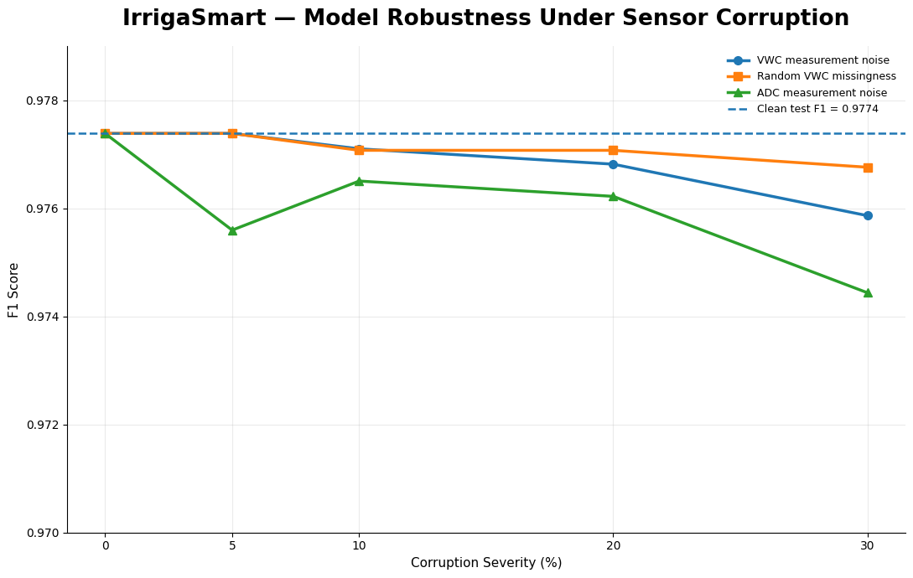

# IrrigaSmart: 12-hour soil-moisture risk prediction

IrrigaSmart predicts whether soil moisture in a vegetable field will fall below an irrigation threshold within the next 12 hours. It uses soil moisture sensors, weather records and field information from farms in Flanders, Belgium, collected from 2021 to 2023.

Most of the work went into the data rather than the model: cleaning faulty sensor readings, defining a target that only looks forward in time, and splitting the data so that no information from the test fields reaches training.

## Methodology



1. **Data cleaning.** Duplicate sensor rows are removed. Invalid soil moisture readings are traced back to the raw sensor signal and filtered. Crop-cycle boundaries are rebuilt from field metadata. Short gaps are interpolated and longer gaps are left missing.
2. **Target.** An observation is labelled 1 (at risk) if the average soil moisture across the three probes falls below 0.18 m³/m³ at any point in the next 12 hours, and 0 otherwise. Future readings are used only to build this label, never as model inputs. This gives 31,492 labelled observations, 37% of them at risk.
3. **Features.** 70 input features in five groups: soil moisture (current values, lags, rates of change and rolling statistics), raw sensor signal, time (hour of day, day of year, days since planting), field context (soil type, irrigation method) and weather and data quality (rainfall, evapotranspiration, gap length). Crop names and sensor IDs are excluded so the model cannot memorise individual fields. One-hot encoding expands the inputs to 78 columns.
4. **Split by crop cycle.** Whole crop cycles go to one split only, so readings from the same field and season never appear in both training and testing. All preprocessing is fitted on the training split.
5. **Model selection.** Logistic Regression, Random Forest, Extra Trees, Gradient Boosting and HistGradientBoosting are compared on the validation split, together with two simple baselines: a soil-moisture-only Logistic Regression and the rule "flag if current soil moisture is below 0.18". HistGradientBoosting is selected.
6. **Evaluation.** The test split is used once, after model selection. The selected model is then checked for explainability, probability calibration and robustness to sensor faults.

| Split | Observations | Crop cycles | At-risk rate |
|---|---|---|---|
| Train | 21,993 | 11 | 37.3% |
| Validation | 5,141 | 3 | 37.7% |
| Test | 4,358 | 3 | 37.7% |

## Results

All results below are on the test split: 4,358 observations from 3 crop cycles that played no part in training or model selection.

| Model | Accuracy | Precision | Recall | F1 | ROC-AUC | PR-AUC |
|---|---|---|---|---|---|---|
| HistGradientBoosting (selected) | 0.983 | 0.982 | 0.973 | 0.977 | 0.999 | 0.998 |
| Random Forest | 0.982 | 0.982 | 0.969 | 0.975 | 0.998 | 0.997 |
| Logistic Regression, soil moisture only | 0.969 | 0.948 | 0.971 | 0.959 | 0.997 | 0.995 |
| Rule: current soil moisture < 0.18 | 0.979 | 0.994 | 0.951 | 0.972 | n/a | n/a |

Soil moisture changes slowly, so the current reading already says a lot about the next 12 hours, and the simple rule reaches an F1 of 0.972. The selected model's gain is in recall: it misses 44 at-risk cases, against 81 for the rule. That gain is real but modest, and the rule is kept in the table so the model is never judged in isolation.

| Validation and test comparison | Test confusion matrix |
|---|---|
|  |  |

### Explainability

Permutation importance puts about 95% of the predictive signal on the soil moisture features. This is expected: the best guide to soil moisture in 12 hours is the current reading and how fast it is changing.

| Top 15 features | Importance by feature group |
|---|---|
|  |  |

### Calibration

Predicted probabilities match observed rates closely on the validation split (Brier score 0.0038, expected calibration error 0.003).



### Robustness to sensor faults

The selected model was tested with up to 30% of test readings corrupted in three ways. F1 dropped by less than 0.003 in every case.

| Corruption at 30% | Test F1 | Drop |
|---|---|---|
| None | 0.977 | 0 |
| Noise in soil moisture readings | 0.976 | 0.0015 |
| Soil moisture readings missing | 0.977 | 0.0006 |
| Noise in raw sensor signal | 0.974 | 0.0029 |



## Dataset

| Item | Detail |
|---|---|
| Source | Flanders soil moisture and irrigation dataset, KU Leuven and partners |
| Period | 2021 to 2023 |
| Sites | Kruisem, Herent, Sint-Katelijne-Waver and Kinrooi, Belgium |
| Crops | leek, cauliflower, onion, carrot, pea, chicory, pumpkin, celery and others |
| Contents | TEROS 10 soil moisture sensor readings, irrigation, rainfall, reference evapotranspiration, soil samples, sensor metadata |
| License | CC BY 4.0 |

The data is not included in this repository. Please credit the original authors:

> Hendrickx, M. G. A., Vanderborght, J., Janssens, P., Bombeke, S., Matthyssen, E., Waverijn, A., and Diels, J.: Pooled error variance and covariance estimation of sparse in situ soil moisture sensor measurements in agricultural fields in Flanders, *SOIL*, 11, 435–456, https://doi.org/10.5194/soil-11-435-2025, 2025.

## Repository structure

```
irrigasmart-soil-moisture-risk/
├── notebooks/
│   └── irrigasmart_end_to_end_pipeline.ipynb   complete pipeline, from data cleaning to robustness tests
├── figures/                                    plots and diagrams exported from the notebook
├── requirements.txt
├── .gitignore
└── LICENSE
```

## How to run

1. Clone the repository and install the dependencies:

   ```bash
   git clone https://github.com/nadim7009/irrigasmart-soil-moisture-risk.git
   cd irrigasmart-soil-moisture-risk
   pip install -r requirements.txt
   ```

2. Download the dataset (see the citation above) and place the files in `data/raw/flanders_dataset/`.

3. Open `notebooks/irrigasmart_end_to_end_pipeline.ipynb`. It was written for Google Colab with Google Drive. To run it locally, set `PROJECT_DIR` to your project folder and skip the Drive mount cell.

## Limitations

- The data covers 17 crop cycles, and the test split covers 3 of them. Results may differ for other crops, soils or regions.
- The 0.18 m³/m³ threshold is the same for every crop and soil. A practical irrigation tool would use crop- and soil-specific thresholds.
- The simple rule is already a strong baseline, so the model's improvement over it is modest.

## Planned work

- A Streamlit app that takes current sensor readings and returns the 12-hour risk with an explanation.
- Crop-specific thresholds and longer forecast horizons.

## License

Code: MIT License (see [LICENSE](LICENSE)). Data: CC BY 4.0, owned by the original dataset authors.

## Contact

Nadim Mahmud, Daffodil International University
[LinkedIn](https://www.linkedin.com/in/nadim-mahmud-ml/) · [GitHub](https://github.com/nadim7009)
