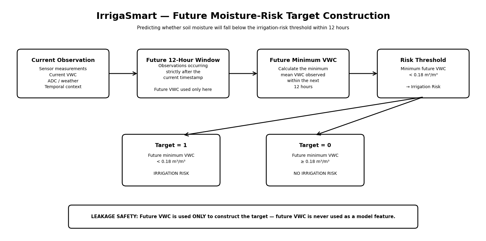
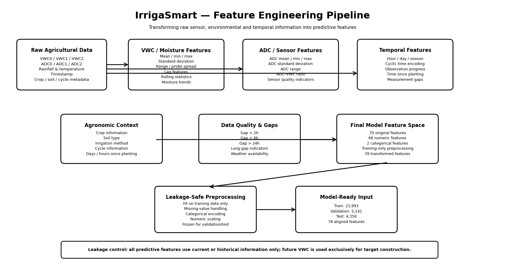
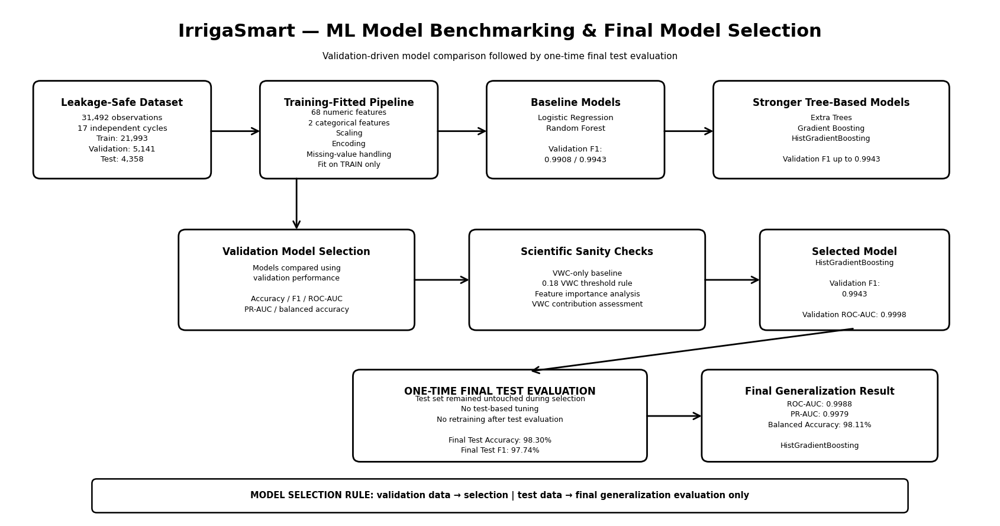
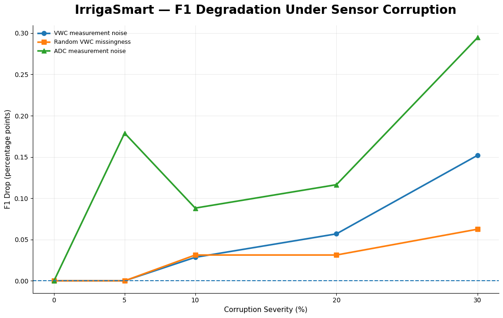
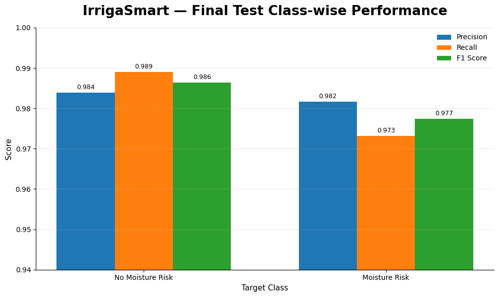

# IrrigaSmart: predicting soil-moisture risk 12 hours ahead

IrrigaSmart is a machine learning pipeline that predicts whether soil moisture in a vegetable field will fall below an irrigation threshold within the next 12 hours. It uses in-field soil moisture sensors, weather data and crop information from real farms in Flanders, Belgium.

Most of the work in this project went into the data, not the model. The raw sensor data had duplicates, invalid readings and overlapping crop cycles, and a careless split would have leaked future information into training. The pipeline cleans the data step by step, defines a forward-looking target, splits by crop cycle, and only touches the test set once.


## Results at a glance

Final test set: 4,358 observations from 3 crop cycles that were never seen during training or model selection.

| Model | Accuracy | Precision | Recall | F1 | ROC-AUC | PR-AUC |
|---|---|---|---|---|---|---|
| **HistGradientBoosting (selected)** | **0.983** | 0.982 | **0.973** | **0.977** | **0.999** | **0.998** |
| Random Forest | 0.982 | 0.982 | 0.969 | 0.975 | 0.998 | 0.997 |
| Logistic Regression, soil-moisture features only | 0.969 | 0.948 | 0.971 | 0.959 | 0.997 | 0.995 |
| Rule: current moisture < 0.18 m³/m³ | 0.979 | 0.994 | 0.951 | 0.972 | n/a | n/a |

A note on these numbers: soil moisture changes slowly, so the current reading already says a lot about the reading 12 hours later. The simple threshold rule in the last row gets an F1 of 0.972. The selected model improves mainly on recall, catching more of the cases where moisture is about to drop below the threshold (44 missed cases against 81 for the rule). The high scores reflect an easy-to-predict signal, which is why the pipeline compares every model against this rule rather than reporting the model in isolation.

## Dataset

| Item | Detail |
|---|---|
| Name | Flanders agricultural soil moisture and irrigation dataset |
| Provider | KU Leuven and partners (principal investigator: Marit Hendrickx) |
| Period | 2021 to 2023 |
| Sites | Kruisem, Herent, Sint-Katelijne-Waver and Kinrooi (Belgium) |
| Crops | leek, cauliflower, onion, carrot, pea, chicory, pumpkin, celery and others |
| Files | sensor readings (TEROS 10 probes), irrigation, precipitation, reference evapotranspiration (ETo), soil samples, sensor metadata |
| License | CC BY 4.0 |

The dataset is not included in this repository. Related publication:

> Hendrickx, M. G. A., Vanderborght, J., Janssens, P., Bombeke, S., Matthyssen, E., Waverijn, A., and Diels, J.: Pooled error variance and covariance estimation of sparse in situ soil moisture sensor measurements in agricultural fields in Flanders, *SOIL*, 11, 435–456, https://doi.org/10.5194/soil-11-435-2025, 2025.

## Pipeline

### 1. Data quality

- Removed duplicate sensor observations after checking that duplicates agreed with each other.
- Traced invalid volumetric water content (VWC) values back to the raw ADC signal and found the ADC range where the TEROS 10 conversion stops being valid.
- Checked agreement between the three moisture probes at each station and flagged sensor outages.
- Rebuilt crop-cycle boundaries from metadata and observation dates, and resolved overlapping cycles.
- Filled only short gaps by interpolation. Longer gaps stay missing and are handled by the model pipeline.

### 2. Target definition



`moisture_risk_12h = 1` if the minimum mean VWC over the next 12 hours drops below **0.18 m³/m³**, otherwise 0.

Future readings are used only to build the target. No feature looks ahead in time. After cleaning, 31,492 observations are eligible, with about 37% positive.

### 3. Feature engineering



70 features in five groups, expanded to 78 after one-hot encoding:

- **Soil moisture (VWC):** current mean, min, max and spread across probes, lags, changes and rolling statistics over 3, 6, 12 and 24 observations.
- **Sensor (ADC):** raw ADC values and the ADC-to-VWC ratio.
- **Time:** hour of day and day of year encoded as sine and cosine, days since planting, progress through the crop cycle.
- **Agronomic context:** soil type and irrigation method. Crop names and sensor IDs are kept out of the features so the model cannot memorise individual fields.
- **Weather and data quality:** precipitation, ETo, gap length and missing-data indicators.

### 4. Leakage-safe split

Splitting by row would put readings from the same field and week into both train and test. The split is done by whole crop cycle instead:

| Split | Observations | Crop cycles | Positive rate |
|---|---|---|---|
| Train | 21,993 | 11 | 37.3% |
| Validation | 5,141 | 3 | 37.7% |
| Test | 4,358 | 3 | 37.7% |

All preprocessing (imputation, scaling, encoding) is fitted on the training set only.

### 5. Model selection



Six models were compared on the validation set: Logistic Regression, Random Forest, Extra Trees, Gradient Boosting, HistGradientBoosting and a soil-moisture-only Logistic Regression. HistGradientBoosting was chosen on validation results, and the test set was evaluated once, after the choice was made.


### 6. Explainability

Permutation importance shows that the soil-moisture features carry about 95% of the predictive signal. That matches the physics of the problem: the best guide to soil moisture in 12 hours is the current reading and how fast it is changing.

| Top 15 features | Importance by group |
|---|---|
|  |  |

### 7. Calibration

The predicted probabilities are well calibrated on validation data (Brier score 0.0038, expected calibration error 0.003). Isotonic calibration fitted on validation data improves them slightly further.


### 8. Robustness to sensor problems

Real sensors drift, drop out and produce noisy readings. The final model was tested with up to 30% of the test data corrupted in three ways:

| Stress test (30% severity) | Test F1 | Drop from clean |
|---|---|---|
| None (clean) | 0.977 | 0 |
| Noise added to VWC readings | 0.976 | 0.0015 |
| VWC readings randomly missing | 0.977 | 0.0006 |
| Noise added to ADC signal | 0.974 | 0.0029 |

| F1 under corruption | F1 drop |
|---|---|
|  |  |

### 9. Final test evaluation

| Confusion matrix | Class-wise performance |
|---|---|
|  |  |

## Repository structure

```
irrigasmart-soil-moisture-risk/
├── notebooks/
│   └── irrigasmart_end_to_end_pipeline.ipynb   full pipeline: data audit, cleaning, features, split, models, XAI, robustness
├── figures/                                    diagrams and result plots exported from the notebook
├── requirements.txt
├── .gitignore
└── LICENSE
```

## How to run

1. Clone the repository and install the dependencies:

   ```bash
   git clone https://github.com/nadim7009/irrigasmart-soil-moisture-risk.git
   cd irrigasmart-soil-moisture-risk
   pip install -r requirements.txt
   ```

2. Download the Flanders soil moisture dataset (see the publication above) and place the files in `data/raw/flanders_dataset/`.

3. Open `notebooks/irrigasmart_end_to_end_pipeline.ipynb`. It was written for Google Colab with Google Drive. If you run it locally, change `PROJECT_DIR` at the top to your project folder and skip the Drive mount cell.

## Limitations

- Only 17 crop cycles in total, so the test set covers 3 cycles. Results may differ on other crops, soils or regions.
- The 0.18 m³/m³ threshold is a single fixed value for all crops and soils. A real irrigation advisor would use crop- and soil-specific thresholds.
- Because soil moisture is slow to change, a simple threshold on the current reading is already a strong baseline. The model's gain over it is real but modest.

## Planned work

- An interactive Streamlit app that takes current sensor readings and returns the 12-hour risk with an explanation.
- Crop-specific thresholds and a longer forecast horizon.

## License

Code: MIT License, see [LICENSE](LICENSE).
Data: CC BY 4.0, owned by the original dataset authors.

## Contact

Nadim Mahmud, Daffodil International University
[LinkedIn](https://www.linkedin.com/in/nadim-mahmud-ml/) · [GitHub](https://github.com/nadim7009)
